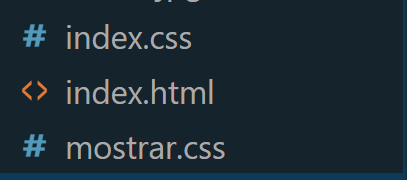
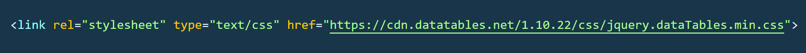
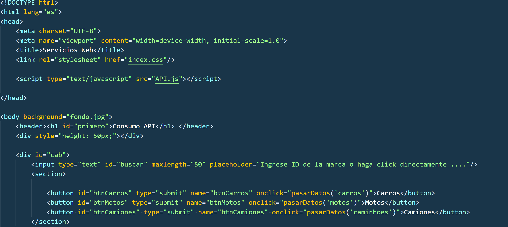
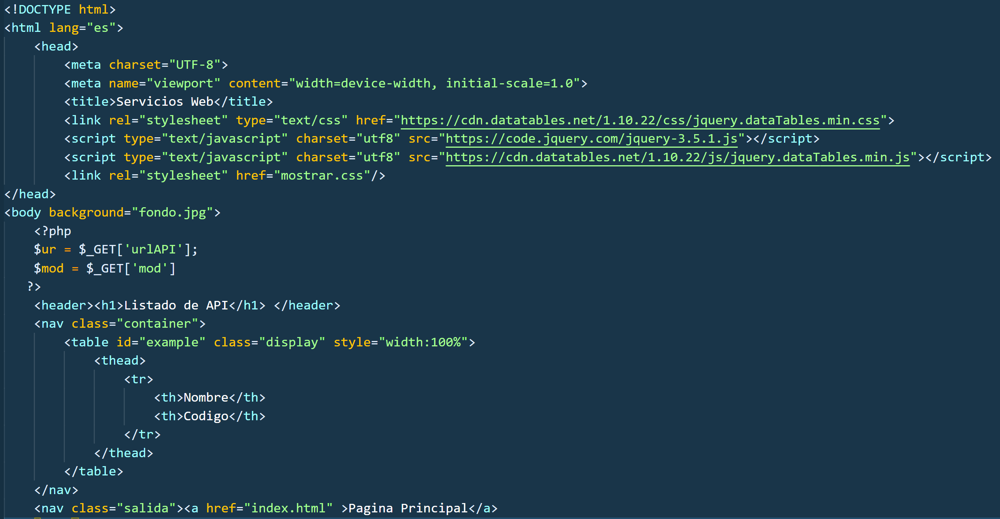
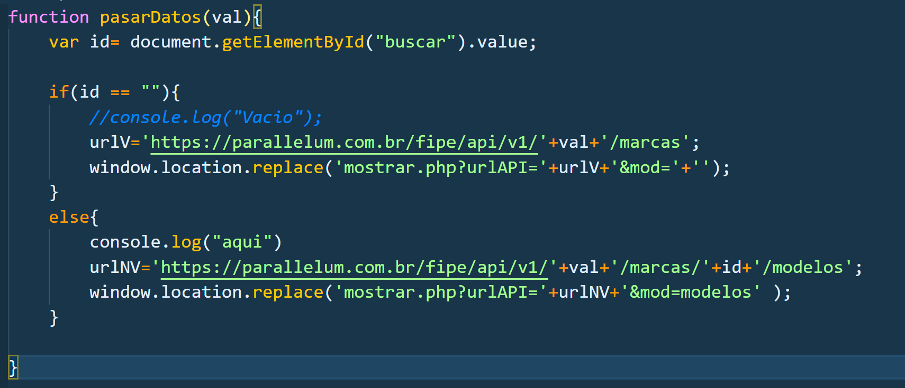
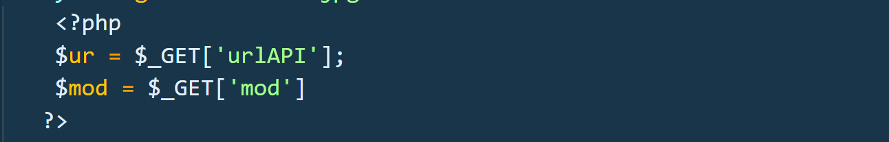
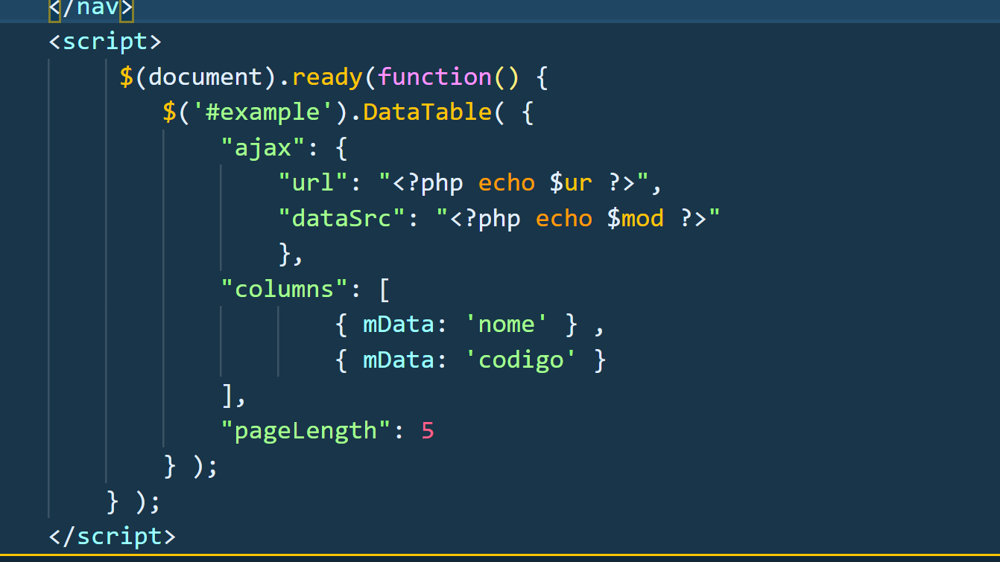

# Practica00-Consumo-de-APIs-en-la-nube
•	Api Gratuita Escogida de API LIST FUN

   La Api escogida es en referencia a gusto personal, el cuál se escogió uno en donde nos muestra marca de vehículos, motos y camiones. La url de la API https://deividfortuna.github.io/fipe/?ref=apilist.fun, se visualizar claramente array y objetos con lo cuál se implementara en la aplicación.

•	Desarrollo de buenas practicas en la interfaz

   Para el diseño de la página no se realizó con plantillas externas, más bien, fue diseñada propiamente con el lenguaje de hojas de estilo (Css). Creando una hoja de estilo por cada página.

</img>

   Para la visualización de la información de las API en la tabla se realizo con una plantilla externa de JQuery, la cual nos ayuda a organizar los datos filas por filas y también se integra funcionalidades avanzadas como el filtrado, el orden y en este caso la paginación. 

</img>

   El diseño de la página principal que se muestra al usuario queda como se visualiza en la siguiente imagen.  
   El código para visualizar la pagina principal es la siguiente.

</img>

</img>

   La pagina en donde se Visualiza la información de la API es la siguiente.
   Al igual se visualizar el código para ver el listado.
   
</img>

</img>

•	Búsqueda de la información

   Para la búsqueda de la información de la API se realizo mediante el id, en donde nos muestra los modelos que existen ya sea en carro, motos o camiones.
   En la página principal se introdujo un input tipo texto en donde pondremos el id para ver los modelos de cierto carro. Como se muestra en la página principal.
   Para la validación se uso JavaScript, en donde también se envía la url en donde se aloja la información de la API.
   
 </img>
    
   El envió de la url se logro como se muestra en la imagen anterior, pero para la recepción de la url se usa el siguiente código en la pagina para mostrar, en donde se guarda en una variable la información recibida.
   
</img>
    
•	Visualizar la Información y aplicación de paginación

   Como antes se mencionaba se muestra la información de la API en una tabla, en donde también se agrega a la tabla una plantilla que nos ayuda a la filtración, orden, etc. Como se va a observar en la siguiente imagen se muestra el código AJAX que se uso para que DataTable de jquery, realice la paginación, y la información actualizada.
   
</img>

